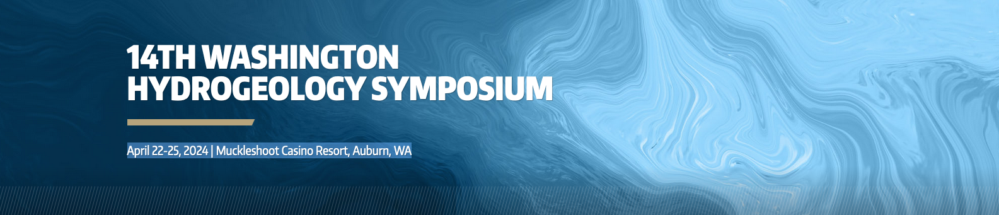

# Python for Hydrogeology
Training materials for the Python and Hydrogeology Workshop offered during the [2024 Washington Hydrogeology Symposium](https://www.wahgs.uw.edu/)

## Date and Location
* April 22-25, 2024 
* Muckleshoot Casino Resort, Auburn, WA

## Course Description
Python is a popular programming language that can be used by hydrogeologists to automate repetitive tasks, perform scientific analyses, create publication-quality graphics, and develop graphical animations of scientific data and model results.  The purpose of this one-day introductory workshop is to help hydrogeologists get up and running with Python.   The first half of the workshop will focus on Python fundamentals, including how packages are managed and installed, strategies for writing Python scripts, and use of the popular Numpy, Matplotlib, and Pandas packages.  During the second half of the workshop participants will learn to work with spatial data, solve analytical solutions of groundwater equations, create animations, and develop groundwater models.  This workshop consists of hands-on exercises designed improve overall Python proficiency.  Participants will need to bring a laptop computer to the workshop; software information will be provided in advance of the class.  The workshop presenter will communicate with registered participants on final content and other workshop materials.

## Intended Audience
This course is suited for hydrogeologists interested in learning about the Python programming language and how it can be used for improving scientific workflows.  For attendees wanting to run live demonstrations, instructions for installing the required software on a laptop computer (Windows, Mac, and Linux operating systems will be supported) will be provided in advance of the course.  No previous experience with Python is required, however, participants without any Python experience may benefit from additional preparation prior to the class.

## Instructor
* [Christian Langevin, US Geological Survey](https://www.usgs.gov/staff-profiles/christian-langevin)

## Workshop Logistics
On Thursday, April 25, all workshops are running from 8 AM to 5 PM. Continental breakfast will be available from 7:30-8:00 AM. There will be a mid-morning break 9:30-9:50 AM and an afternoon break from 3:00-3:20 PM, both with coffee, tea, and light refreshments.

## Agenda

| Time | Subject |
| --- | --- |
| 8:00 | Introductions |
| 8:15 | Getting started |
| 9:30 | Break |
| 9:50 | Numpy and Matplotlib |
| 12:00 | Lunch |
| 1:00 | Theis drawdown exercise |
| 2:30 | FloPy and MODFLOW |
| 3:00 | Break |
| 3:20 | FloPy and MODFLOW (cont) |
| 4:45 | Wrap up |
| 5:00 | Adjourn |

## Topics
* Getting Started
  - Understanding and installing Python distributions and environments
  - Jupyter notebooks
* Python basics
  - Python as a calculator
  - Variables and assignment
  - Strings
  - Lists, tuples, and dictionaries
  - Loops and conditionals
  - Working with files
* Numpy
  - Creating arrays
  - Indexing
  - Array expressions
* Matplotlib
* Theis example
* Creating animations
* Constructing, running, and post-processing a MODFLOW groundwater model

## Software
See the [Software Installation Page](./SOFTWARE.md) for software installation sections.
